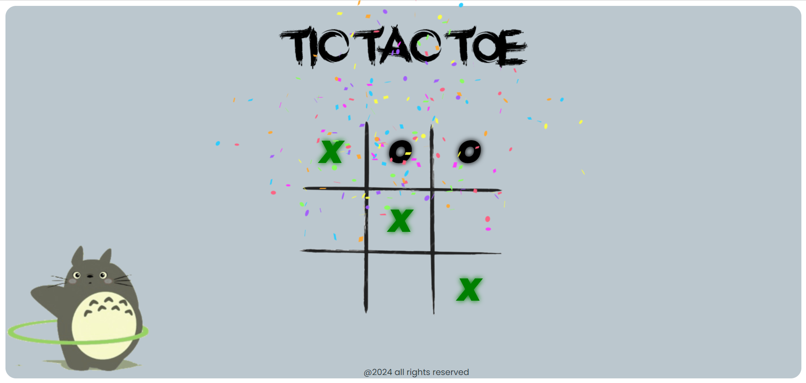
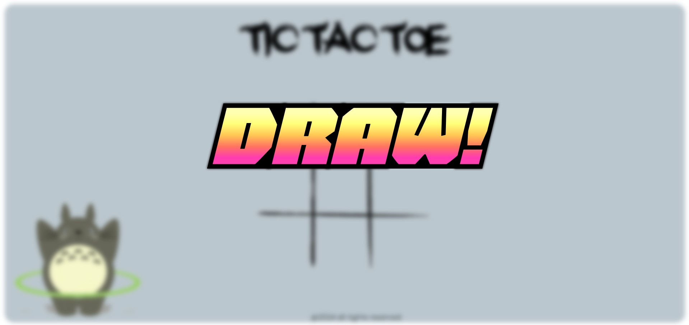

# Tic Tac Toe Game 🎮

This project is a web-based implementation of the classic Tic Tac Toe game, developed using HTML, CSS, and JavaScript. It features an interactive user interface with sound effects and celebratory animations for a delightful gaming experience.

## Key Features ✨
- **Celebratory Animations** 🎉: Celebrate your victories with fun and colorful animations.
- **Sound Effects** 🔊: Experience enhanced gameplay with custom sound effects for moves and wins.
- **2-Player Game Mode** 👥: Challenge a friend in the classic 2-player mode.
- **Interactive Gameplay**: Enjoy a seamless and engaging Tic Tac Toe game.
- **Responsive Design** 📱: Play the game on any device, thanks to the responsive design.
- **Clean and Modular Code** 🧩: The project is structured with clean and modular code, making it easy to understand and extend.

## How to Play 🕹️
1. Clone the repository: `git clone https://github.com/sumo90/Tic-Tac-Toe.git`
2. Open `index.html` in your browser.
3. Start playing by clicking on the cells to place your mark (X or O).

## Technologies Used 💻
- **HTML**: For structuring the game interface.
- **CSS**: For styling the game and adding animations.
- **JavaScript**: For game logic and interactivity.

## Screenshots:
 

## Contributing 🤝
Feel free to fork this repository and contribute by submitting pull requests. Any improvements or suggestions are welcome!

## License 📜
This project is licensed under the MIT License - see the [LICENSE](LICENSE) file for details.
